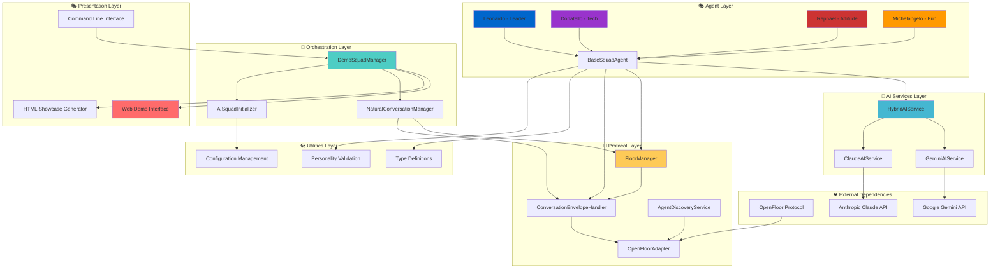
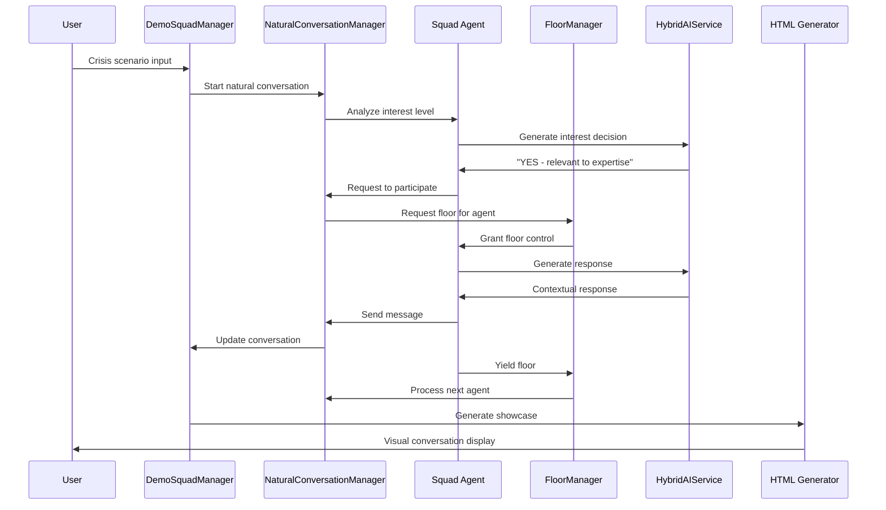

# Natural Conversation Test Suite - Architecture Overview

## System Overview

The Natural Conversation Test Suite (TMNT Crisis Squad) is a multi-agent conversational AI system that demonstrates Open Floor Protocol (OFP) capabilities through four specialized agents with 90s cartoon personalities. The system enables natural conversations between AI agents while maintaining protocol compliance.

## High-Level Architecture



**Lucid Chart Prompt**: Create a system architecture diagram with 6 layers: Presentation Layer (Web Demo Interface, HTML Showcase Generator, CLI), Orchestration Layer (DemoSquadManager, NaturalConversationManager, AISquadInitializer), Protocol Layer (FloorManager, ConversationEnvelopeHandler, AgentDiscoveryService, OpenFloorAdapter), Agent Layer (Leonardo-Leader, Donatello-Tech, Raphael-Attitude, Michelangelo-Fun, BaseSquadAgent), AI Services Layer (HybridAIService, GeminiAIService, ClaudeAIService), Utilities Layer (Type Definitions, Personality Validation, Configuration Management), and External Dependencies (OpenFloor Protocol, Google Gemini API, Anthropic Claude API). Connect components with directional arrows showing data flow. Use colors: Presentation=#ff6b6b, Orchestration=#4ecdc4, Protocol=#feca57, Agent=#45b7d1, AI Services=#96ceb4, Utilities=#gray, External=#lightblue. Apply turtle-themed colors to individual agents: Leonardo=#0066cc, Donatello=#9933cc, Raphael=#cc3333, Michelangelo=#ff9900.

## Core Architecture Principles

### 1. Open Floor Protocol Compliance
- **Standards Adherence**: Implementation of OFP conversation envelopes, floor management, and agent discovery
- **Event-Driven Architecture**: All agent communication flows through standardized protocol events
- **Interoperability Focus**: Designed for seamless integration with other OFP-compliant systems

### 2. Agent-Centric Design
- **Personality-Driven Behavior**: Each agent has authentic 90s personality with catchphrases and speaking styles
- **Expertise Specialization**: Agents contribute based on their domain expertise (Leadership, Technical, Attitude, Engagement)
- **Natural Participation**: AI-powered decision making for organic conversation flow

### 3. Hybrid AI Architecture
- **Primary + Fallback Strategy**: Gemini AI with Claude failover for quota protection
- **Graceful Degradation**: System continues operating even when AI services are unavailable
- **Performance Optimization**: Sub-second response times with intelligent caching

### 4. Conversation Flow Management
- **Floor Control System**: Priority-based turn-taking with automatic timeout recovery
- **Context Preservation**: Conversation state maintained across agent transitions
- **Natural Participation**: Agents decide organically when to contribute based on relevance

## Key Components Deep Dive

### DemoSquadManager (`src/demo/DemoSquadManager.ts`)
**Orchestrator** - Coordinates all system components and manages conversation lifecycle.

**Responsibilities:**
- Initialize and coordinate all system components
- Process user messages and orchestrate agent responses
- Generate HTML showcases with visual conversation representations
- Manage protocol event emission and monitoring
- Handle real-time streaming of agent contributions

**Key Methods:**
- `initialize()`: Set up AI services, agents, and protocol components
- `processNaturalConversation()`: Facilitate organic multi-agent conversations
- `generateConversationHTML()`: Create visual showcases automatically

### NaturalConversationManager (`src/protocol/NaturalConversationManager.ts`)
**Conversation Orchestrator** - Manages organic agent participation in conversations.

**Core Innovation:**
- Agents use AI to determine their interest in contributing to conversations
- No scripted turn-taking - purely organic participation based on relevance
- Context-aware decision making for natural conversation flow

**Process Flow:**
1. **Interest Analysis**: Ask all agents if they want to contribute using AI
2. **Priority Sorting**: Order interested agents by urgency/expertise
3. **Floor Management**: Coordinate speaking turns through FloorManager
4. **Response Generation**: Generate contextually appropriate responses
5. **Recursive Flow**: Allow responses to trigger further responses naturally

### FloorManager (`src/protocol/FloorManager.ts`)
**Protocol Engine** - Implements Open Floor Protocol floor management with additional features.

**Features:**
- **Priority-Based Queuing**: Leonardo (leader) gets highest priority
- **Timeout Protection**: Prevents deadlocks with automatic recovery
- **Deadlock Detection**: Monitors and resolves circular dependencies
- **Graceful Degradation**: Continues operation when individual agents fail
- **Health Monitoring**: Tracks agent responsiveness and availability

**Event Types Supported:**
- `requestFloor`: Agent requests speaking permission
- `grantFloor`: Floor control granted to agent
- `revokeFloor`: Floor control revoked (timeout/error)
- `yieldFloor`: Agent voluntarily releases floor control

### BaseSquadAgent (`src/agents/base/BaseSquadAgent.ts`)
**Agent Framework** - Abstract base class providing core agent functionality.

**Key Features:**
- **Personality Integration**: Automatic personality flair injection
- **90s Authenticity Validation**: Ensures responses maintain period authenticity
- **AI Integration**: Seamless integration with HybridAIService
- **Protocol Compliance**: Full OFP envelope handling and generation
- **Fallback Mechanisms**: Graceful handling when AI services unavailable

**Agent Specializations:**
- **Leonardo**: Leadership and coordination (`src/agents/LeonardoLeaderAgent.ts`)
- **Donatello**: Technical analysis and research (`src/agents/DonatelloTechAgent.ts`)
- **Raphael**: Reality checks and direct feedback (`src/agents/RaphaelAttitudeAgent.ts`)
- **Michelangelo**: Engagement and creative solutions (`src/agents/MichelangeloFunAgent.ts`)

### HybridAIService (`src/services/HybridAIService.ts`)
**AI Orchestrator** - Manages multiple AI services with intelligent failover.

**Architecture:**
- **Primary Service**: Google Gemini for fast, creative responses
- **Fallback Service**: Anthropic Claude for quota protection
- **Failure Management**: Cooldown periods and retry logic
- **Performance Monitoring**: Response time and success rate tracking

**Benefits:**
- **High Availability**: System continues operating during AI service outages
- **Cost Management**: Intelligent usage patterns to manage API costs
- **Response Diversity**: Multiple AI providers ensure varied responses

## Data Flow Architecture

### Conversation Lifecycle



### State Management

The system maintains several types of state:

1. **Conversation State** (`NaturalConversationManager`)
   - Message history with timestamps and agent attribution
   - Agent participation tracking and contribution counts
   - Interest levels and context preservation

2. **Floor State** (`FloorManager`)
   - Current speaker and floor control status
   - Priority-based request queue
   - Floor transition history and timeout tracking

3. **Agent State** (`BaseSquadAgent`)
   - Personality configuration and authenticity levels
   - AI service connections and failure tracking
   - Response generation context and history

4. **Protocol State** (`ConversationEnvelopeHandler`)
   - Event handlers and validation rules
   - Envelope routing and delivery tracking
   - Error recovery and retry mechanisms

## Integration Points

### External Dependencies

1. **OpenFloor Protocol** (`@openfloor/protocol`)
   - Provides standardized conversation envelope structure
   - Implements dialog events and floor management events
   - Ensures interoperability with other OFP systems

2. **Google Gemini API** (`@google/generative-ai`)
   - Primary AI service for response generation
   - Fast creative responses with personality integration
   - Rate limiting and quota management

3. **Anthropic Claude API** (`@anthropic-ai/sdk`)
   - Fallback AI service for high availability
   - Alternative response generation when Gemini unavailable
   - Different AI perspective for response diversity

### Internal Integration

1. **Type System** (`src/utils/types.ts`)
   - Comprehensive TypeScript definitions for all components
   - Open Floor Protocol type extensions
   - Agent personality and configuration structures

2. **Configuration Management** (`CLAUDE.md`, environment variables)
   - AI service configuration and API keys
   - Agent personality parameters and authenticity thresholds
   - Development and production environment settings

3. **Testing Infrastructure** (`src/test-*.ts`, Vitest)
   - Comprehensive test suite for all major components
   - Integration tests for complete conversation flows
   - Performance benchmarking and regression testing

## Performance Characteristics

### Response Time Benchmarks
- **System Initialization**: 2-3 seconds (AI connection + agent setup)
- **Interest Analysis**: 300ms (4 agents × AI analysis in parallel)
- **Floor Management**: 100ms per floor transition
- **Response Generation**: 1.1 seconds average (AI + validation)
- **HTML Generation**: 500ms (complete visual showcase)

### Scalability Considerations
- **Agent Capacity**: Supports 4-10 agents with current architecture
- **Conversation Length**: Handles 20+ message exchanges
- **Concurrent Conversations**: Multiple conversation threads supported
- **Memory Usage**: Designed for long-running conversations

### Reliability Features
- **Error Recovery**: Multi-layer fallback mechanisms
- **Timeout Protection**: Prevents infinite loops and deadlocks
- **Health Monitoring**: Agent responsiveness tracking
- **Graceful Degradation**: Continues operation during partial failures

## Security Considerations

### API Key Management
- Environment variable configuration for all API keys
- No hardcoded secrets in source code
- Secure credential handling in production environments

### Input Validation
- User input sanitization and validation
- AI response content filtering
- Protocol envelope structure validation

### Error Handling
- Comprehensive error logging without exposing sensitive data
- Graceful failure modes that maintain system stability
- Audit trails for debugging and monitoring

## Development Workflow

### Build and Test Process
```bash
# Development
npm run dev          # Run with ts-node for development
npm run demo         # Start web-based demo server
npm test             # Run comprehensive test suite

# Production
npm run build        # Compile TypeScript to JavaScript
npm start            # Run compiled application
npm run lint         # Code quality and style checks
```

### File Organization
```
src/
├── agents/          # Agent implementations and base classes
├── demo/            # Web interface and demonstration system
├── protocol/        # Open Floor Protocol implementation
├── services/        # External service integrations (AI, etc.)
├── utils/           # Shared utilities and type definitions
├── test-*.ts        # Integration test scenarios
└── index.ts         # Main application entry point
```

## Future Architecture Considerations

### Planned Enhancements
1. **Multi-Modal Support**: Audio and video conversation capabilities
2. **Persistent Storage**: Conversation history and learning capabilities
3. **Scale-Out Architecture**: Support for 20+ agents in conversations
4. **Analytics**: Conversation quality metrics and insights

### Extension Points
1. **Agent Plugins**: Dynamic agent loading and capability extension
2. **Custom AI Services**: Integration framework for additional AI providers
3. **Protocol Extensions**: Support for emerging OFP features
4. **Integration APIs**: RESTful and WebSocket APIs for external systems

## Key Components

### DemoSquadManager
**Location**: `src/demo/DemoSquadManager.ts`
**Purpose**: Primary orchestrator coordinating all system components

**Key Methods**:
- `initialize()`: Set up AI services, agents, and protocol components
- `processNaturalConversation()`: Facilitate organic multi-agent conversations
- `generateConversationHTML()`: Create visual showcases automatically

### NaturalConversationManager
**Location**: `src/protocol/NaturalConversationManager.ts`
**Purpose**: Manages organic agent participation using AI-driven decision making

**Key Methods**:
- `startNaturalConversation()`: Initialize conversation with AI-driven participation
- `gatherAgentInterest()`: Use AI to determine which agents want to participate
- `facilitateAgentContribution()`: Coordinate agent contributions through floor management

### FloorManager
**Location**: `src/protocol/FloorManager.ts`
**Purpose**: Implements Open Floor Protocol floor management with advanced features

**Key Methods**:
- `requestFloor()`: Handle floor control requests with priority-based queuing
- `grantFloor()`: Grant floor control with proper OFP event generation
- `yieldFloor()`: Agent yields floor control with queue processing

### BaseSquadAgent
**Location**: `src/agents/base/BaseSquadAgent.ts`
**Purpose**: Abstract base class providing core functionality for all agents

**Key Methods**:
- `generateAIResponse()`: Generate AI-powered responses with personality integration
- `addPersonalityFlair()`: Inject personality-specific catchphrases and style
- `validate90sAuthenticity()`: Ensure responses maintain authentic 90s references

### HybridAIService
**Location**: `src/services/HybridAIService.ts`
**Purpose**: Manages multiple AI services with intelligent failover

**Key Methods**:
- `generateResponse()`: Generate AI responses with automatic failover
- `testConnections()`: Test availability of all configured AI services

## Documentation References

- **[Conversation Flow Documentation](docs/conversational-flow-diagram.md)**: Visual diagrams and technical deep-dive
- **[OpenFloor Protocol Compliance Report](docs/openfloor-compliance-report.md)**: Complete protocol adherence analysis
- **[Demo Guide](src/demo/README.md)**: How to run and customize demos
- **[Integration Guide](INTEGRATIONS.md)**: External service integration details

---

*This architecture overview provides the foundational understanding needed to work with, extend, or integrate the Natural Conversation Test Suite. For specific implementation details, refer to the linked documentation and source code.*